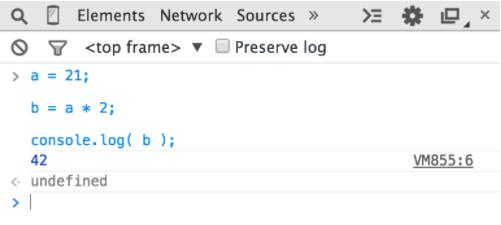
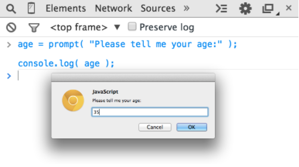
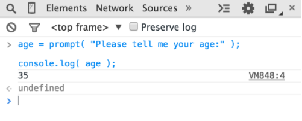

# 1.2 Inténtalo tú mismo

Este capítulo presentará cada concepto de programación con simples fragmentos de código, todo escrito en JavaScript \(¡obviamente!\).

No puede ser enfatizado suficiente: mientras repase este capítulo -- y es posible que deba dedicar tiempo a repasarlo varias veces -- debe practicar cada uno de estos conceptos escribiendo el código usted mismo.La forma más sencilla de hacerlo es abrir la consola en la herramientas de desarrollador del navegador favorito \(Firefox, Chrome, IE, etc.\).

Consejo: Normalmente, puede iniciar la consola de desarrollador con un atajo de teclado o desde una opcion de menú.. Para obtener información más detallada acerca del inicio y el uso de la consola en su navegador favorito, consulte "Dominar la herramientas de desarrollador 'consola'" \([http://blog.teamtreehouse.com/mastering-developer-tools-console](http://blog.teamtreehouse.com/mastering-developer-tools-console)\). Para escribir varias líneas en la consola a la vez, use &lt;shift&gt; + &lt;enter&gt; para pasar a la siguiente  nueva línea. Una vez que pulse &lt;enter&gt; por si misma, la consola ejecutará todo lo que acaba de escribir.

Vamos a familiarizarnos con el proceso de ejecución de código en la consola. En primer lugar, sugiero abrir una pestaña vacía en su navegador. Prefiero hacer esto escribiendo: `about:blank`. A continuación, asegúrese de que su consola de desarrollo está abierta, como acabamos de mencionar.

Ahora, escriba este código y vea cómo se ejecuta:

```js
a = 21;

b = a * 2;

console.log( b );
```

Escribir el código anterior en la consola en Chrome debería producir algo como lo siguiente:



Vamos, prueba. La mejor manera de aprender a programar es empezar a codificar!

### Salida

En el fragmento de código anterior, utilizamos console.log \(..\). En pocas palabras, veamos de qué trata esa línea de código.

Puede haberlo adivinado, pero asi es cómo imprimimos texto \(aka salida al usuario\) en la consola del navegador. Hay dos características de esa declaración que debemos explicar.

En primer lugar, la parte log \(b\) se denomina llamada a función \(véase "Funciones"\). Lo que pasa es que estamos entregando la variable 'b' a esa función, pidiendole que tome el valor de 'b' y lo imprima en la consola.

En segundo lugar, la parte console es una referencia al objeto donde se encuentra la función log \(..\). Cubrimos los objetos y sus propiedades con más detalle en el Capítulo 2.

Otra forma de crear resultados que pueda ver es ejecutar la instrucción de alert\(..\). Por ejemplo:

```js
alert( b );
```

Si ejecuta eso, notará que en lugar de imprimir la salida en la consola, muestra un cuadro emergente "Aceptar" con el contenido de la variable 'b'. Sin embargo, usar console.log \(...\) generalmente hará que el aprendizaje sobre la codificación y ejecución de sus programas en consola resulte más fácil que usar alert \(..\), ya que puede mostrar muchos valores a la vez sin interrumpir la interfaz del navegador.

En este libro, usaremos console.log \(..\) para la salida.

### Entrada

Mientras estamos discutiendo la salida, también puede preguntarse por la entrada \(es decir, recibir información del usuario\).

La forma más común de conseguirlo es con una página HTML que muestre elementos de formulario \(como cuadros de texto\) en el que pueda escribir un usuario usuario y, a continuación, utilizar JS para leer esos valores en variables del programa.

Pero hay una manera más fácil de obtener información para fines sencillos de aprendizaje y demostración, como la que utiliza a lo largo de este libro. Utilice la función de prompt \(..\):

```js
age = prompt( "Por favor, dime tu edad:" );

console.log( age );
```

Como ya habrás adivinado, el mensaje que pasas al prompt \(..\) - en este caso, "Por favor, dime tu edad:" - se imprime en el popup.

Esto debería ser similar a lo siguiente:



Una vez que envíe el texto de entrada haciendo clic en "Aceptar", observará que el valor que escribió se almacena en la variable de edad, que luego se emite con console.log \(..\):



Para mantener las cosas simples mientras estamos aprendiendo conceptos básicos de programación, los ejemplos en este libro no requerirán entrada. Pero ahora que has visto cómo usar el prompt \(..\), si quieres desafiarte puedes intentar usar las entradas al investigar con tus ejemplos.


