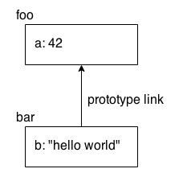

# 2.7 Prototypes

El mecanismo prototype en JavaScript es bastante complicado. Sólo le echaremos un vistazo aquí. Usted querrá pasar un montón de tiempo revisando los capítulos 4-6 del título de this y los objetos prototipos de esta serie para todos los detalles.

Cuando hace referencia a una propiedad en un objeto, si esa propiedad no existe, JavaScript utilizará automáticamente la referencia de prototipo interno de ese objeto para buscar otro objeto en el que buscar la propiedad. Se podría pensar en esto casi como un fallback si la propiedad está desaparecida.

El vínculo de referencia del prototipo interno de un objeto a su fallback ocurre en el momento en que se crea el objeto. La forma más sencilla de ilustrarlo es con una utilidad incorporada llamada `Object.create(..)`.

Considere:

```js
var foo = {
	a: 42
};

// crear `bar` y vincularlo a` foo`
var bar = Object.create( foo );

bar.b = "hello world";

bar.b;		// "hello world"
bar.a;		// 42 <-- delegado a `foo`
```

Puede ayudar a visualizar los objetos `foo` y `bar` y su relación:



La propiedad `a` no existe en realidad en el objeto `bar`,  pero debido a que `bar` está vinculada al prototipo de `foo`, JavaScript automáticamente vuelve a buscar en el objeto `foo`, donde la encuentra.

Este vínculo puede parecer una característica extraña del lenguaje. La forma más común de usar esta característica -y yo diría, de forma abusiva- es tratar de emular/falsificar un mecanismo de "clase" con "herencia".

Pero una forma más natural de aplicar prototipos es con un patrón llamado "delegación de comportamiento", en el que se diseñan los objetos vinculados intencionadamente para poder delegar de unos a otros partes del comportamiento necesario.

**Nota**: Para obtener más información sobre los prototipos y la delegación de comportamiento, consulte los capítulos 4-6 del título This y Objetos Prototipos de esta serie.
