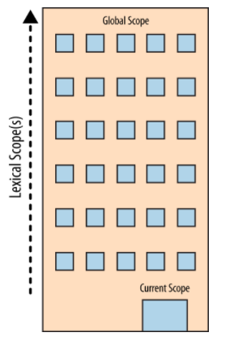

# 1.3 Scopes Anidados

Dijimos que Scope es un conjunto de reglas para buscar variables por su nombre de identificador. Sin embargo, generalmente hay más de un ámbito a considerar.

Así como un bloque o función está anidado dentro de otro bloque o función, los ámbitos están anidados dentro de otros ámbitos. Por lo tanto, si no se puede encontrar una variable en el ámbito inmediato, Motor consulta el siguiente ámbito externo que contiene, hasta que se encuentre o hasta que se alcance el acope más externo \(aka, global\).

Considere:

```js
function foo(a) {
	console.log( a + b );
}

var b = 2;

foo( 2 ); // 4
```

La referencia RHS para `b` no se puede resolver dentro de la función `foo`, pero puede resolverse en el ámbito que lo rodea \(en este caso, global\).

Así que, revisitando las conversaciones entre Motor y Scope, escucharíamos:

> Motor: "Oye, Scope de `foo`, alguna vez oído hablar de `b`? Tengo una referencia de RHS para el."
>
> Scope: "No, nunca he oído hablar de él"
>
> Motor: "Oye, Scope fuera de `foo`, oh! eres el alcance global, ok cool. ¿Has oído hablar de `b`? Tengo una referencia de RHS para el."
>
> Scope: "Sí, claro que sí"

Las reglas simples para atravesar un Scope anidado: Motor se inicia en el scope que está actualmente en ejecución, busca la variable allí, luego si no se encuentra, sigue subiendo un nivel, y así sucesivamente. Si se alcanza el alcance global más externo, la búsqueda se detiene, si encuentra o no la variable.

### Construyendo sobre metáforas

Para visualizar el proceso de resolución anidada de un Scope, quiero que pienses en este alto edificio.



El edificio representa el conjunto de reglas de scope anidado de nuestro programa. El primer piso del edificio representa el ámbito actualmente en ejecución, dondequiera que se encuentre. El nivel superior del edificio es el alcance global.

Usted resuelve las referencias de LHS y RHS mirando su piso actual, y si no lo encuentra, toma el ascensor al siguiente piso, buscando allí, luego al siguiente, y así sucesivamente. Una vez que llegas a la planta superior \(el alcance global\), o bien encuentras lo que estás buscando, o no lo haces. Pero tienes que parar en algún momento.


